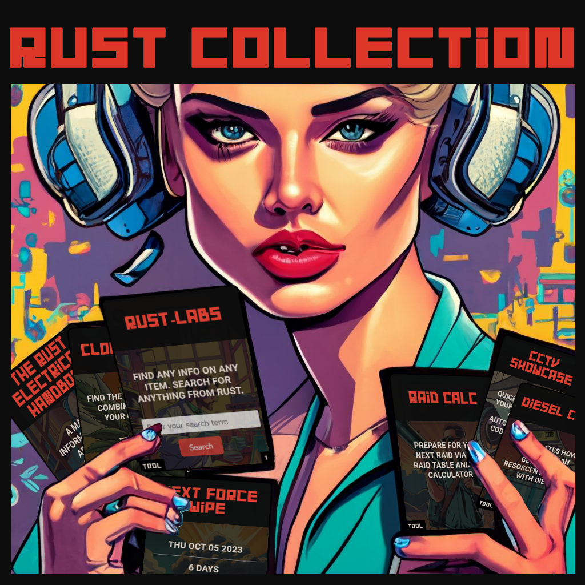

     

# Rust-Collection 🎮

[Welcome to the Rust-Collection! 🚀](https://napoii.github.io/Rust-Collection/)

Are you ready to level up your Rust gaming experience? Look no further! This repository is your one-stop-shop for mastering the art of survival in the harsh world of Rust. Our collection of guides, tools, and resources will equip you with everything you need to dominate the game.

[Visitor statistics](https://counterapi.com/stats/Rust-Collection)

🃏 **About This Repository**

Each card in this repository represents a valuable resource for Rust players. Just like in a trading card game, you can use these cards to enhance your Rust gameplay. Whether you're a seasoned Rust veteran or a newcomer to the game, you'll find something here to elevate your skills and knowledge.

🌟 **Contribute and Collect**

This repository thrives on community contributions. If you have a Rust guide, tool, or resource that you think would benefit fellow Rust players, don't hesitate to contribute. It's as easy as submitting a new card to our collection.

🤖 **Get in Touch**

Have questions or suggestions? Want to connect with other Rust enthusiasts? Join our community on Discord and stay updated with the latest developments.

👏 **Acknowledgments**

A huge thank you to all the contributors who have helped make this repository a valuable resource for the Rust gaming community. Together, we're building an incredible collection of Rust guides and tools.

📝 **License**

This repository is licensed under the MIT License - see the [LICENSE](LICENSE) file for details.

Enjoy your Rust journey and may your cards always be in your favor! 🃏🌟

MIT License

Copyright (c) 2023 NapoII
<small><small><small>
Permission is hereby granted, free of charge, to any person obtaining a copy
of this software and associated documentation files (the "Software"), to deal
in the Software without restriction, including without limitation the rights
to use, copy, modify, merge, publish, distribute, sublicense, and/or sell
copies of the Software, and to permit persons to whom the Software is
furnished to do so, subject to the following conditions:

The above copyright notice and this permission notice shall be included in all
copies or substantial portions of the Software.

THE SOFTWARE IS PROVIDED "AS IS", WITHOUT WARRANTY OF ANY KIND, EXPRESS OR
IMPLIED, INCLUDING BUT NOT LIMITED TO THE WARRANTIES OF MERCHANTABILITY,
FITNESS FOR A PARTICULAR PURPOSE AND NONINFRINGEMENT. IN NO EVENT SHALL THE
AUTHORS OR COPYRIGHT HOLDERS BE LIABLE FOR ANY CLAIM, DAMAGES OR OTHER
LIABILITY, WHETHER IN AN ACTION OF CONTRACT, TORT OR OTHERWISE, ARISING FROM,
OUT OF OR IN CONNECTION WITH THE SOFTWARE OR THE USE OR OTHER DEALINGS IN THE
SOFTWARE.
    

